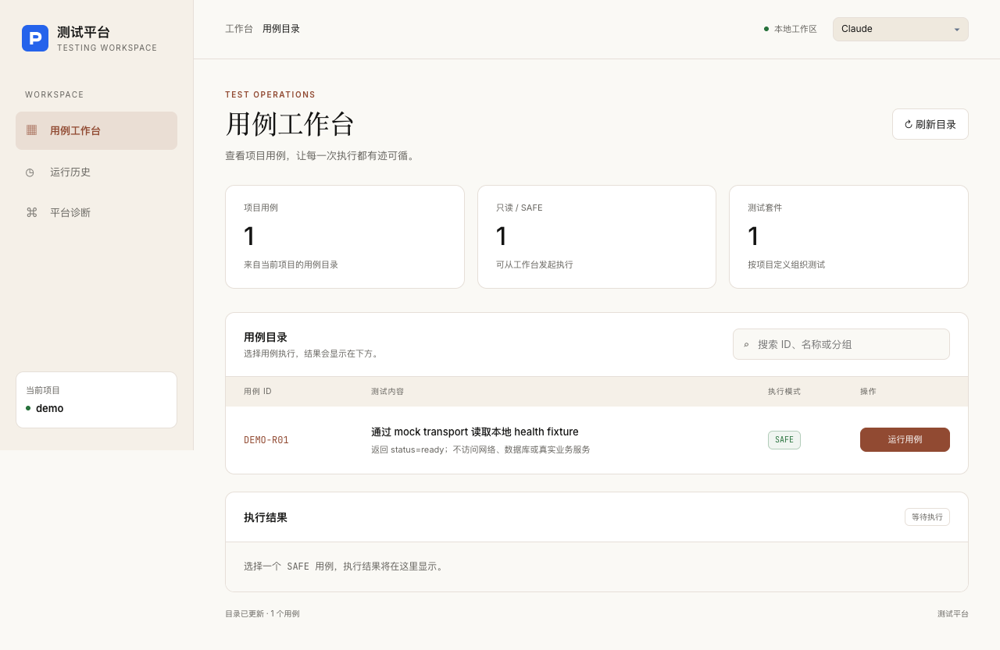
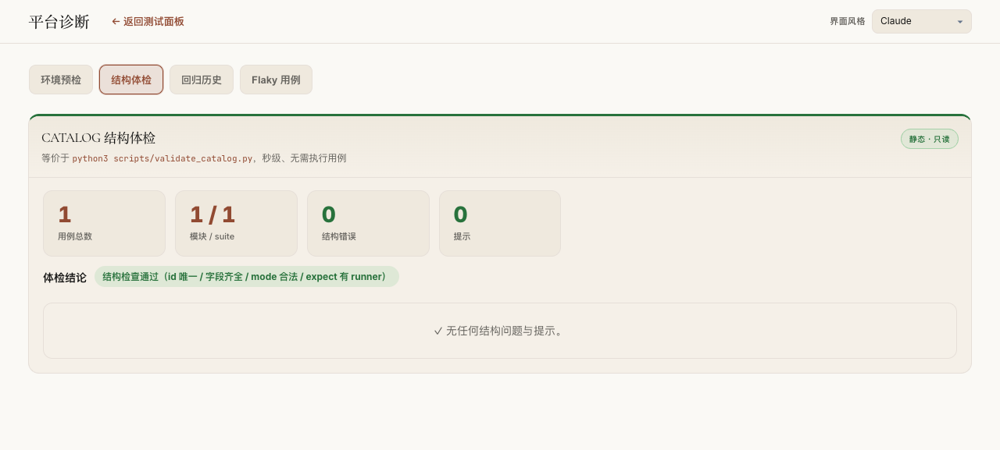

# 测试平台基座验收矩阵

验收环境：Python 3.9、Node.js 20、macOS，2026-10-08。验收范围为独立平台当前文件及干净发行，使用自有模拟服务和临时业务 Pack。未运行真实业务案例，未修改真实主业务仓库。

| 目标 | 交付内容 | 验收结果 |
| --- | --- | --- |
| 平台与业务隔离 | 平台通用配置、无固定账号分类、可选资源池和诊断、Pack 自有案例/认证/契约/测试 | 完成：当前文件和干净发行通过；独立 Git 历史已按用户要求删除 |
| Agent 完整接入说明 | 快速入口、完整手册、manifest 协议、案例注册、认证、序列化、执行任务、历史、资源、回归、发行和故障排查 | 离线骨架及 HTTP 契约生成流程均实际执行通过 |
| 新业务快速接入 | 一条生成命令、独立环境/端口/数据、离线验证、Pack 定向测试、独立 HTTP 启动 | 两个新 Pack 无 Core 修改完成端到端接入 |

## 自动验收

- [受影响定向回归](affected-regression.json)：257 项 Python、8 项 JavaScript，全通过；未映射源码为 0，未执行业务全量案例。原生进程沙箱、清空继承环境、临时数据及后代进程守卫启用；临时数据已清理。
- [Core / Pack 隔离](isolation.json)：78 个 Core 文件、16 个通用组件，零缺口。
- [独立接入端到端](integration.json)：13 项通过。干净平台导出、双项目启动、目录隔离、可选能力关闭、真实本地 HTTP 与声明鉴权、执行契约指纹、请求去重、原始 JSON 错误类型、第二项目可用、历史分离、401 失败、缺凭据 incomplete、清理自有进程和临时数据。
- [直接从交付发行包复验](delivered-artifact-integration.json)：相同 13 项全部通过，不依赖开发目录。
- 中性发行扫描：源码、文件名和文档链接通过；不读取凭据、运行数据、IDE 配置或 Git 历史。发行不包含这些内容。
- [发行和接入最终复验](export-regression.json)：16 项通过。分发报告省略已删除旧资产的文件名映射；测试数量与执行结论保留。
- [发行入口及文档最终回归](delivery-docs-regression.json)：16 项通过；发行 README 与开发目录一致，快速入口和所有本地文档链接存在。
- 删除仓库元数据前的 Git diff 空白检查通过；没有提交或推送。平台当前不需要 Git；定向回归使用显式 --group 或 --file。
- [无 Git 最终回归](no-git-regression.json)：66 项通过；接入工具、发行和平台隔离均可在无仓库元数据时使用。

## 界面验收

工作台保留完整 CSS、本地字体、四种主题、案例筛选和结果区。未声明资源池不显示固定账号分类；基础诊断只展示环境预检、结构体检、历史与 Flaky。接口契约、数据库、异常日志由 Pack 单独声明。

[工作台扫描](home-accessibility.json)与[诊断页扫描](diagnostics-accessibility.json)均为 0 项自动违规；各有 1 类需要人工判断的扫描项，不能据此宣称所有可访问性标准已认证。人工截图检查通过。





## 接入者的验收边界

当前 HTTP 快速模板支持明确 GET、环境变量 header 鉴权和显式 JSON 字段类型。复杂登录、签名、刷新、写流程及项目序列化策略须由所属 Pack 实现。mock 通过不会证明未来真实服务契约通过；真实接口的环境、账号、允许操作与字段证据由接入项目负责。

2026-10-09 按用户要求直接删除平台自身独立 `.git` 目录；本次操作未移动、未备份、未重建仓库。删除前核实没有共享元数据、工作树或远端；删除后原有 200 个交付文件哈希一致，源码、配置和运行数据保留。历史残留阻塞已解除。

## 复现命令

在平台根目录运行；定向回归需要 Python 与 Node.js。端到端工具需要允许本机回环端口，会自动清理其创建的服务和临时数据。

```sh
python3 scripts/check_neutral_distribution.py
python3 scripts/check_platform_isolation.py --json
python3 scripts/targeted_regression.py --group onboarding --group distribution --group isolation --group execution-ui --report /tmp/foundation-regression.json
python3 scripts/accept_project_integration.py --report /tmp/integration.json
```

接入从 [快速入口](../../onboarding/QUICKSTART.md) 开始，完整协议见 [Agent 手册](../../onboarding/AGENT_INTEGRATION.md)。

## 2026-10-09 两个目标再次深入核验

1. 当前目录已没有 Git 元数据。扫描范围扩大到隐藏文件和二进制内容，保留用户指定的新平台目录名，未发现旧项目标识或旧 checkout 路径；[完整本地扫描](recheck-local-scan.json)。发行文本、文件名与文档链接门禁继续通过，Core/Pack 归属见 [最新隔离报告](recheck-isolation.json)。
2. Agent 文档包含完整接入协议与两条快速入口；实际生成的 Pack README 已完善，HTTP 模式采用正确的 HTTP-MOCK-R01 命令，列出本 Pack 配置、运行/停止、测试与后续实现位置。契约地址和认证键不能覆盖平台启动选择、端口、数据根或时区。

[本轮接入及发行定向回归](recheck-onboarding.json)：17 项全部通过，HTTP README 给出的 mock 验证命令实际执行通过；所有平台启动键被错误用作业务地址或认证时，生成器在产生 Pack 和环境文件前拒绝。

[本轮独立双项目接入](recheck-integration.json)：13 项全部通过。验证仍只使用自有 loopback 模拟业务和临时平台，不运行真实业务案例。两个目标均已完成，本轮又修补了接入体验和配置碰撞缺口。
